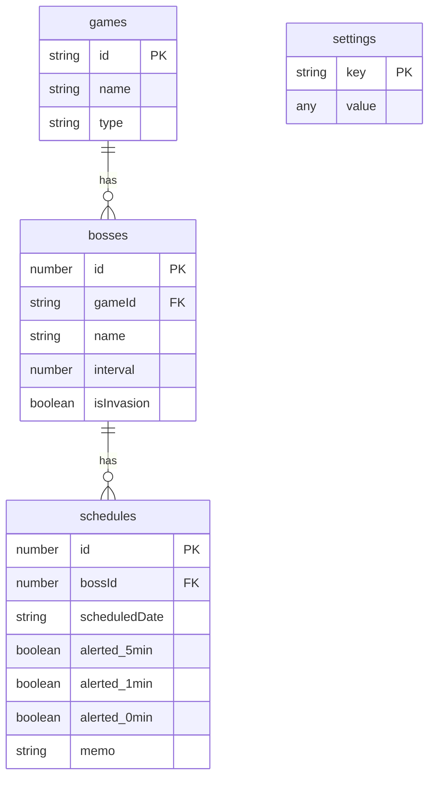

# DB 스키마 명세 (v3.0 — 4-테이블 LocalStorage 정규화 DB)

`src/db.js`에 구현된 LocalStorage 기반 4-테이블 정규화 스키마를 정식 명세합니다.

---

## 1. LocalStorage 저장 키

| 상수명 (KEYS) | 실제 키 값 | 설명 |
|---|---|---|
| `KEYS.GAMES` | `v3_games` | 게임 목록 테이블 |
| `KEYS.BOSSES` | `v3_bosses` | 보스 메타데이터 테이블 |
| `KEYS.SCHEDULES` | `v3_schedules` | 보스 스케줄(일정) 테이블 |
| `KEYS.SETTINGS` | `v3_settings` | 앱 설정 단일 객체 |
| `KEYS.UID_COUNTER` | `v3_uid_counter` | 자동증가 PK 카운터 |

각 키는 `JSON.stringify` / `JSON.parse`로 직렬화되어 저장됩니다.  
`v3_settings`는 배열이 아닌 **플랫 객체** `{ key: value }` 형태입니다.

---

## 2. 테이블 스키마

### 2.1. games (`v3_games`)

게임(보스 목록 그룹)을 나타냅니다. `preset-loader.js`의 `syncPresetsToDb()`로 동기화됩니다.

| 컬럼 | 타입 | 제약 | 설명 |
|---|---|---|---|
| `id` | `string` | PK, NotNull | 게임 식별자 (예: `"odin-main"`, `"커스텀 보스_001"`) |
| `name` | `string` | NotNull | 게임 표시명 (예: `"오딘: 발할라 라이징"`) |
| `type` | `string` | NotNull | `"preset"` 또는 `"custom"` |

- PK는 **문자열 ID** (preset 게임은 JSON 키, custom은 사용자 지정 이름)  
- `id`가 동일한 경우 `upsertGame()`이 기존 레코드를 덮어씁니다 (멱등 upsert)

---

### 2.2. bosses (`v3_bosses`)

보스 메타데이터를 저장합니다. 스케줄은 별도 테이블로 분리됩니다.

| 컬럼 | 타입 | 제약 | 설명 |
|---|---|---|---|
| `id` | `number` | PK, NotNull, AutoIncrement | `DB.nextId()`로 자동 발급 |
| `gameId` | `string` | FK → games.id, NotNull | 소속 게임 ID |
| `name` | `string` | NotNull | 보스명 (예: `"데카르도"`) |
| `interval` | `number` | — | 젠 주기 (분). 0이면 고정 시각 보스 |
| `isInvasion` | `boolean` | — | `true`이면 당일에만 출현하는 침공형 보스 |

- `(gameId, name)` 쌍이 **Unique** (논리적 복합 키, `upsertBoss()`로 보장)  
- `preset-loader.js`의 `syncPresetsToDb()`가 `boss-presets.json`의 `bossMetadata`를 기반으로 upsert하며, 프리셋에서 제거된 보스는 `DB.deleteBoss()`로 cascade 삭제합니다

---

### 2.3. schedules (`v3_schedules`)

보스 출현 일정(인스턴스)을 저장합니다. 48시간 윈도우 기준으로 동적 확장됩니다.

| 컬럼 | 타입 | 제약 | 설명 |
|---|---|---|---|
| `id` | `number` | PK, NotNull, AutoIncrement | `DB.nextId()`로 자동 발급 |
| `bossId` | `number` | FK → bosses.id, NotNull | 대상 보스 ID |
| `scheduledDate` | `string` | NotNull | 출현 예정 시각 (ISO 8601, 예: `"2026-04-19T12:00:00.000Z"`) |
| `alerted_5min` | `boolean \| number` | NotNull, default `false` | 5분 전 알림 완료 여부 (완료 시 targetTime 숫자로 저장) |
| `alerted_1min` | `boolean \| number` | NotNull, default `false` | 1분 전 알림 완료 여부 |
| `alerted_0min` | `boolean \| number` | NotNull, default `false` | 정각 알림 완료 여부 |
| `memo` | `string` | NotNull, default `""` | 메모 |

- `alerted_*` 필드: `false`(미완료) 또는 `targetTime`(Unix ms 숫자, 완료) 이중 상태
- GC 정책: `alerted_0min`이 완료된 **과거** 레코드는 `_expandAndReconstruct()` 실행 시 자동 삭제 (단, 보스당 최소 1개는 보존)
- `replaceSchedulesByGameId(gameId, newSchedules)`: 해당 게임의 모든 스케줄을 원자적으로 교체

---

### 2.4. settings (`v3_settings`)

앱 전체 설정을 단일 JSON 객체로 저장합니다. 키-값 플랫 구조입니다.

| 설정 키 | 타입 | 기본값 | 설명 |
|---|---|---|---|
| `lastSelectedGame` | `string` | — | 마지막으로 선택한 게임 ID |
| `lastAutoUpdateTimestamp` | `number` | — | 마지막 자동 업데이트 시각 (Unix ms) |
| `fixedAlarms` | `Array` | 기본 5개 | 고정 알림 목록 (LocalStorageManager 관리) |
| `logVisibilityState` | `boolean` | `true` | 로그 패널 표시 여부 |
| `alarmRunningState` | `boolean` | `false` | 알람 실행 상태 |
| `muteState` | `boolean` | `false` | 음소거 상태 |
| `volume` | `number` | `1` | 음량 (0.0 ~ 1.0) |
| `preMuteVolume` | `number` | `1` | 음소거 이전 음량 (복원용) |
| `crazyCalculatorRecords` | `Array` | `[]` | 광 계산기 기록 |

`fixedAlarms` 배열 요소 구조:

```json
{
  "id": "fixed-1",
  "name": "대륙 침략자",
  "time": "12:00",
  "enabled": false,
  "days": [0, 1, 2, 3, 4, 5, 6]
}
```

---

## 3. ERD 다이어그램 (Mermaid)



---

## 4. FK 관계 및 Cascade 정책

| 관계 | 방향 | Cascade 정책 |
|---|---|---|
| `bosses.gameId → games.id` | N:1 | `deleteGame(id)` 시 `deleteBossesByGameId(id)` 자동 호출 |
| `schedules.bossId → bosses.id` | N:1 | `deleteBoss(id)` 시 `deleteSchedulesByBossId(id)` 자동 호출 |

게임 삭제 → 소속 보스 전체 삭제 → 소속 스케줄 전체 삭제 (3단 cascade).

---

## 5. 자동증가 PK (`v3_uid_counter`)

`DB.nextId()`는 `v3_uid_counter` 값을 1 증가시킨 후 저장하고 반환합니다.  
`bosses`와 `schedules`가 동일한 카운터를 공유하므로, PK 값은 테이블 간 전역 유일(globally unique)입니다.

---

## 6. 무결성 검증 규칙 (`DB.importAll()`)

`importAll(data)` 함수는 외부 데이터(백업 복원 등) 적재 시 다음 규칙으로 유효성을 검증합니다.

| 테이블 | 검증 조건 | 실패 처리 |
|---|---|---|
| `games` | `id`, `name`, `type` 모두 `undefined`가 아닐 것 | 해당 레코드 제외 후 계속 |
| `bosses` | `id`, `gameId`, `name` 모두 `undefined`가 아닐 것 | 해당 레코드 제외 후 계속 |
| `schedules` | `id`, `bossId`, `scheduledDate` 모두 `undefined`가 아닐 것 | 해당 레코드 제외 후 계속 |
| `schedules` (FK) | `bossId`가 유효한 bosses 목록에 존재할 것 | 해당 레코드 제외 후 계속 |

FK 검증은 `bosses`가 `importAll` 내에서 먼저 처리된 경우에만 수행됩니다. `bosses` 없이 `schedules`만 단독으로 주어진 경우 FK 검증은 생략됩니다.

오류 발생 시 `console.error`로 로그를 남기고 정상 레코드만 저장합니다 (부분 성공 허용).

---

## 7. 버전 관리 정책

현재(v3.0)는 **단일 버전** 정책입니다. 마이그레이션 전략:

- `v3_*` 키 접두사가 버전을 나타냅니다. 이전 버전(`v1_*`, `v2_*`) 키와 충돌하지 않습니다.
- v3 이전 데이터 호환: `app.js`의 `performSilentMigration()` / `performReverseMigration()`이 구 포맷 데이터를 감지하여 v3 구조로 자동 이관합니다.
- `DB.clear()`는 `KEYS`에 열거된 5개 키를 모두 삭제합니다 (공장 초기화).
- `DB.exportAll()` / `DB.importAll()`을 통해 전체 스냅샷 백업 및 복원이 가능합니다.
- 스키마 구조 변경 시 `KEYS` 상수의 버전 접두사를 변경하여 구 데이터를 자동 격리합니다.
