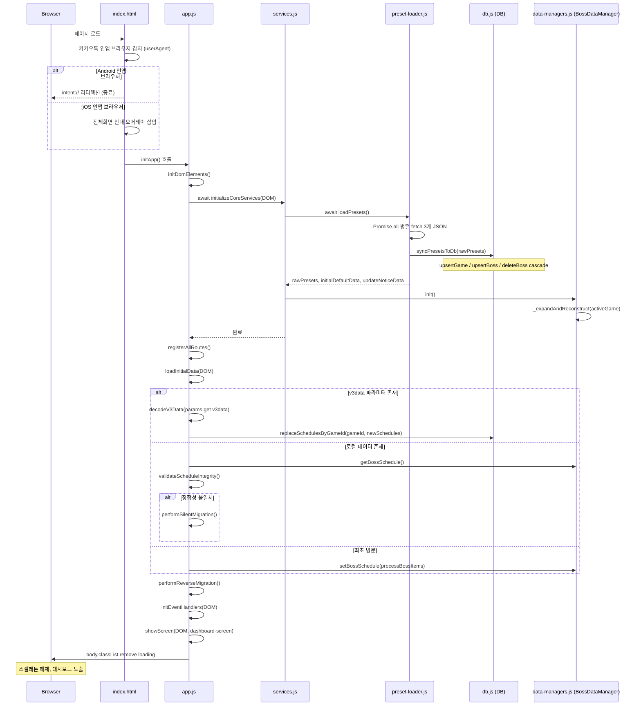
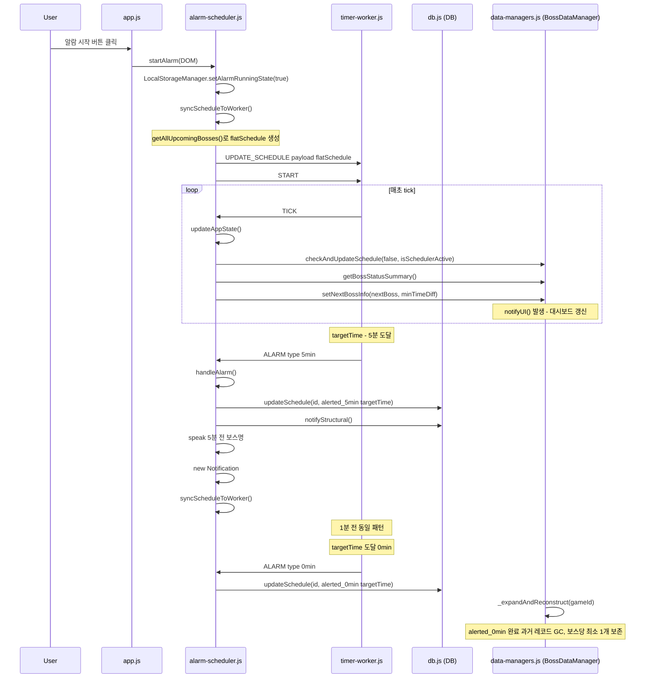
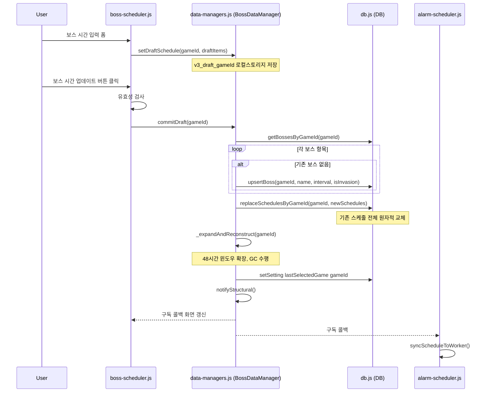
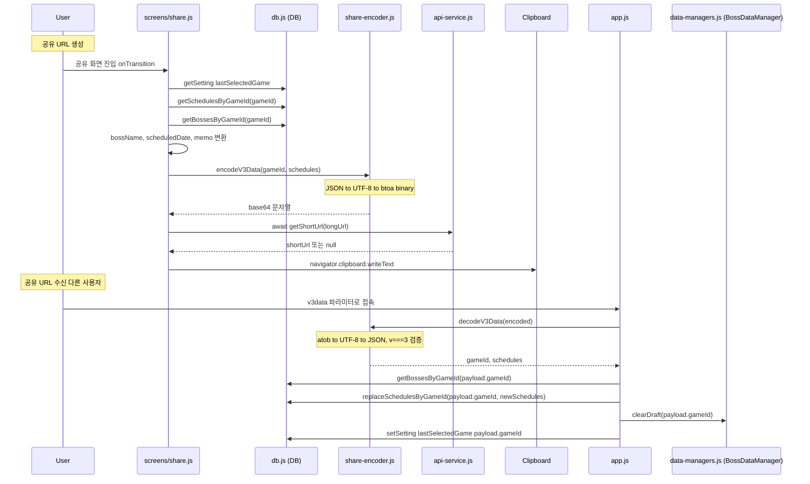
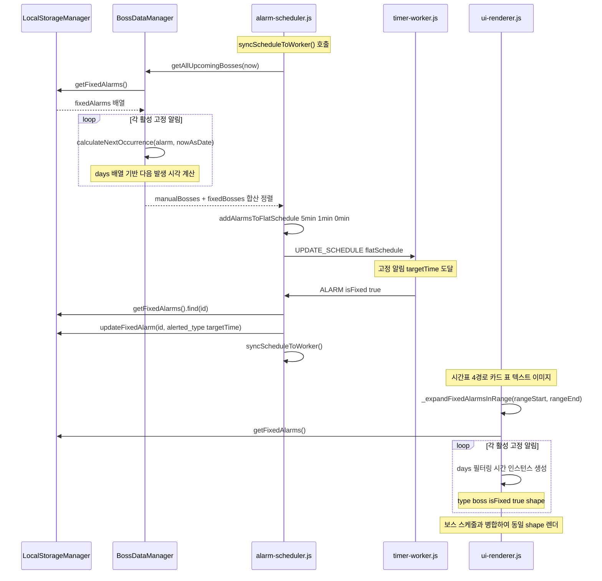
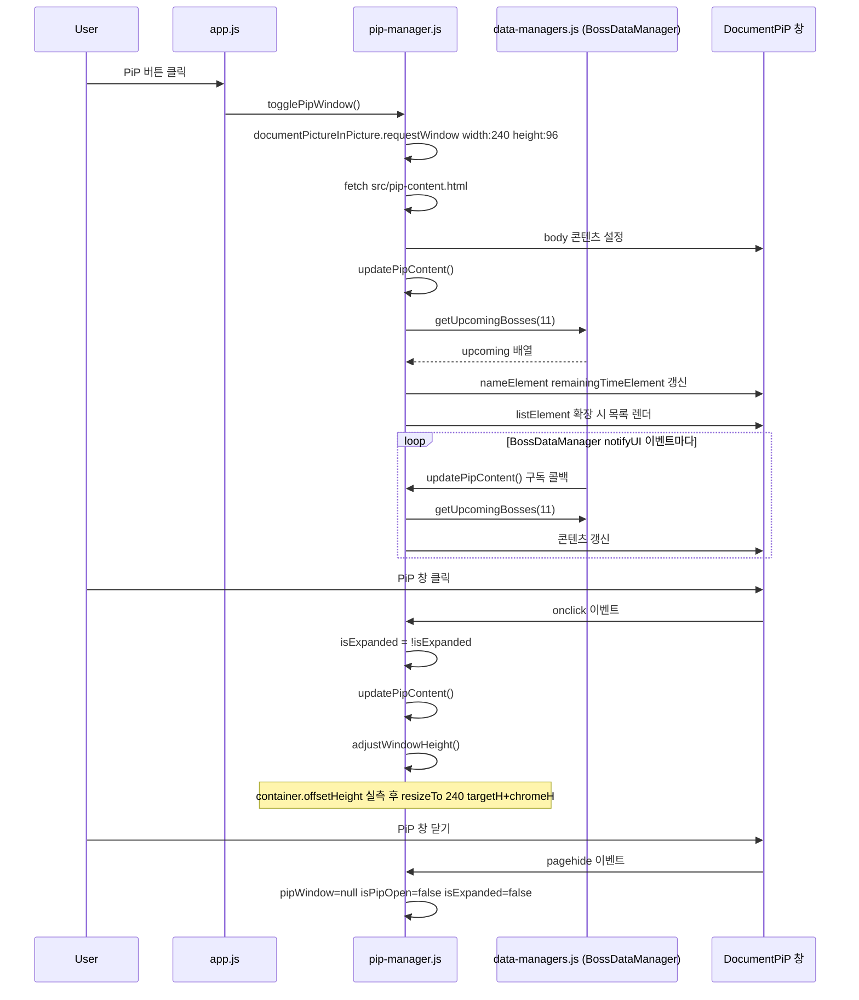

# 시퀀스 다이어그램 — 보스 알리미 v3.0 핵심 흐름

각 다이어그램은 코드의 실제 함수명과 파일명을 기준으로 작성되었습니다.

---

## 1. 앱 초기 로드

`index.html`이 브라우저에 로드된 시점부터 대시보드가 사용자에게 노출되기까지의 흐름입니다. 카카오톡 인앱 브라우저 감지, 프리셋 병렬 로드, URL 파라미터 분기, 48시간 자동 확장이 순서대로 진행됩니다.

`app.js`의 `initApp()`이 최상위 오케스트레이터 역할을 수행하며, `loadPresets()`의 비동기 완료를 기다린 뒤 `loadInitialData()`로 데이터 우선순위를 결정합니다.

---

## 2. 알람 라이프사이클

사용자가 알람을 시작한 시점부터 보스 알림이 발생하고 GC가 수행되기까지의 흐름입니다.

메인 스레드와 Web Worker(`timer-worker.js`)가 분리되어 있으며, ALARM 이벤트는 워커에서 발생하여 메인 스레드의 `handleAlarm()`이 처리합니다. 알림 완료 후 `syncScheduleToWorker()`로 워커의 스케줄이 갱신됩니다.

---

## 3. 보스 시간 입력 → 저장

보스 스케줄러 화면에서 사용자가 시간을 입력하고 저장하는 흐름입니다.

`boss-scheduler.js`가 폼 입력을 처리하고 `BossDataManager.commitDraft()`를 통해 DB에 원자적으로 커밋합니다. 커밋 후 `notifyStructural()`이 구독자들에게 전파되어 UI가 갱신됩니다.

---

## 4. 공유 URL 생성 및 수신

공유 화면에서 URL을 생성하는 흐름과, 공유 URL을 통해 다른 사용자가 접속했을 때 데이터가 복원되는 흐름입니다.

인코딩은 `share-encoder.js`의 순수 함수 `encodeV3Data()`가 담당하며, TinyURL API 호출은 `api-service.js`에서 수행합니다. 수신 측은 `app.js`의 `loadInitialData()`에서 URL 파라미터를 감지하여 `DB.replaceSchedulesByGameId()`로 적용합니다.

---

## 5. 고정 알림 발생 → 시간표 표시

고정 알림(`fixedAlarms`)이 알람 시스템에 통합되는 흐름과, 시간표 화면에서 고정 알림이 4가지 렌더 경로 모두에 병합되어 표시되는 흐름입니다.

`_expandFixedAlarmsInRange()`가 고정 알림을 `{ type:boss, isFixed:true }` shape으로 변환하여 보스 스케줄과 동일하게 처리합니다.

---

## 6. PiP 위젯 동기화

Document Picture-in-Picture 창을 열고 보스 정보를 주기적으로 갱신하는 흐름입니다.

`pip-manager.js`의 `updatePipContent()`는 `BossDataManager`의 `ui` 구독을 통해 호출됩니다. 사용자가 PiP 창을 클릭하면 목록 확장/축소가 토글되며, `adjustWindowHeight()`가 DOM 실측 기반으로 창 크기를 조절합니다.

