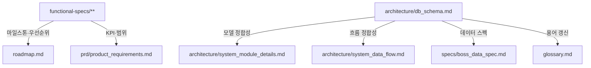

# 보스 알람 — 문서 지식 지도

`wiki-config.yaml`의 사람용 요약. 코드↔문서 매핑, 문서간 의존성, 변경 영향도를 한눈에 본다.

> 자동화: 코드/문서 변경 시 [`bohe-doc-sync`](https://) 스킬이 이 매핑을 사용해 연쇄 갱신을 검사한다. 기계 판독 원본은 `.claude/wiki-config.yaml`.

---

## 1. 문서 카테고리 트리

```
docs/
├── prd/                       제품 요구사항 (Why/What)
│   └── product_requirements.md
├── roadmap.md                 현재/단기/중기/장기 마일스톤
│
├── architecture/              구조와 정책 (How — 큰 그림)
│   ├── system_architecture.md   레이어 구조
│   ├── system_data_flow.md      데이터 흐름
│   ├── system_module_details.md 모듈 명세
│   ├── system_module_dependencies.md  모듈 의존
│   ├── critical_code_policy.md  핵심 로직 정책
│   ├── db_schema.md             4-테이블 ERD
│   ├── nfr.md                   비기능 요구사항
│   └── sequence_diagrams.md     6개 핵심 흐름 시퀀스
│
├── functional-specs/          메뉴별 FRD (How — 화면 단위)
│   ├── dashboard.md / timetable.md / boss-scheduler.md
│   ├── boss-management.md / calculator.md / settings.md
│   ├── share.md / alarm-log.md / help-faq.md
│   ├── version-info.md / application-common-features.md
│   └── index.md
│
├── specs/                     기술 스펙
│   ├── boss_data_spec.md         보스 데이터 JSON 스키마
│   ├── real-time-schedule-sharing-spec.md
│   └── screen_composition_plan.md
│
├── guides/                    개발/운영 가이드
│   ├── development_workflow_guide.md / testing_strategy.md
│   ├── security_policy.md / deployment.md
│   ├── design_system_guide.md / theme_guide.md
│   ├── design_migration_guide.md / analytics_naming_convention.md
│
├── glossary.md                도메인 용어 25+
├── knowledge_map.md           이 문서
├── README.md                  진입점 (역할별 동선)
│
├── issues/                    의사결정 이력 (미해결 13 + resolved 26)
├── session-log/               세션 인수인계 (archive/ 포함)
├── notes/                     아이디어/메모
├── archive/                   옛 계획·체크리스트·보고서
└── sample_color/              색상 자산 (sync 제외)
```

---

## 2. 코드 ↔ 문서 매핑 매트릭스

코드를 변경하면 함께 갱신해야 할 문서.

### 2.1 화면 (`src/screens/*.js`)

| 코드 | 1차 문서 | 2차 문서 |
|---|---|---|
| `screens/dashboard.js` | `functional-specs/dashboard.md` | — |
| `screens/timetable.js` | `functional-specs/timetable.md` | `functional-specs/dashboard.md` (고정 알림 4경로 일관성) |
| `screens/boss-scheduler.js` | `functional-specs/boss-scheduler.md` | `functional-specs/boss-management.md` (v3 통합) |
| `screens/calculator.js` | `functional-specs/calculator.md` | — |
| `screens/share.js` | `functional-specs/share.md` | `specs/real-time-schedule-sharing-spec.md` |
| `screens/settings.js` | `functional-specs/settings.md` | — |
| `screens/alarm-log.js` | `functional-specs/alarm-log.md` | — |
| `screens/help.js` | `functional-specs/help-faq.md` | — |
| `screens/version-info.js` | `functional-specs/version-info.md` | — |
| `screens/custom-list.js` | `functional-specs/boss-scheduler.md` | (커스텀 보스 모달) |

### 2.2 핵심 모듈

| 코드 | 영향 문서 |
|---|---|
| `db.js` | `architecture/db_schema.md` · `system_data_flow.md` · `system_module_details.md` |
| `data-managers.js` | `architecture/system_module_details.md` · `critical_code_policy.md` · `functional-specs/dashboard.md` · `functional-specs/timetable.md` |
| `preset-loader.js` | `architecture/system_data_flow.md` · `specs/boss_data_spec.md` |
| `boss-scheduler-data.js` | `functional-specs/boss-scheduler.md` · `specs/boss_data_spec.md` |
| `alarm-scheduler.js` | `architecture/sequence_diagrams.md` · `functional-specs/dashboard.md` · `functional-specs/settings.md` · `architecture/critical_code_policy.md` |
| `share-encoder.js` | `functional-specs/share.md` · `specs/real-time-schedule-sharing-spec.md` |
| `event-bus.js` | `architecture/system_module_dependencies.md` · `system_module_details.md` |

### 2.3 UI/공통

| 코드 | 영향 문서 |
|---|---|
| `ui-renderer.js` | `functional-specs/dashboard.md` · `timetable.md` · `alarm-log.md` · **`guides/security_policy.md`** (innerHTML) |
| `pip-manager.js` | `functional-specs/dashboard.md` · `architecture/sequence_diagrams.md` · `guides/security_policy.md` |
| `logger.js` | `functional-specs/alarm-log.md` · `guides/security_policy.md` |
| `router.js` | `functional-specs/application-common-features.md` |
| `app.js` | `architecture/sequence_diagrams.md` · `functional-specs/application-common-features.md` |
| `services.js` | `architecture/system_module_dependencies.md` |
| `calculator.js` / `crazy-calculator.js` | `functional-specs/calculator.md` |
| `custom-list-manager.js` | `functional-specs/boss-scheduler.md` |
| `api-service.js` | `functional-specs/help-faq.md` · `architecture/system_data_flow.md` |
| `speech.js` | `functional-specs/settings.md` · `functional-specs/dashboard.md` |
| `analytics.js` | `guides/analytics_naming_convention.md` |
| `workers/timer-worker.js` | `architecture/sequence_diagrams.md` · `architecture/nfr.md` (1초 정확도) |

### 2.4 데이터/메타

| 파일 | 영향 문서 |
|---|---|
| `data/version_history.json` | `CHANGELOG.md` · `functional-specs/version-info.md` |
| `data/boss-presets.json` | `specs/boss_data_spec.md` |
| `package.json` | `CONTRIBUTING.md` |

---

## 3. 문서 ↔ 문서 의존성 그래프



---

## 4. 변경 영향도 — "X 바꿨다, 무엇을 봐야 하나"

| 트리거 | 우선 확인 | 추가 확인 |
|---|---|---|
| **DB 스키마 변경** (`db.js`) | `architecture/db_schema.md` | `system_data_flow.md` · `system_module_details.md` · `specs/boss_data_spec.md` · `glossary.md` |
| **알람 로직 변경** (`alarm-scheduler.js`) | `architecture/sequence_diagrams.md` | `functional-specs/dashboard.md` · `functional-specs/settings.md` · `architecture/critical_code_policy.md` |
| **공유 URL 변경** (`share-encoder.js`, `screens/share.js`) | `functional-specs/share.md` | `specs/real-time-schedule-sharing-spec.md` |
| **렌더링 변경** (`ui-renderer.js`) | 영향 화면 FRD | `guides/security_policy.md` (innerHTML 추가 시) |
| **새 화면 추가** (`screens/X.js`) | `functional-specs/X.md` 신규 | `application-common-features.md` (라우트) · `docs/knowledge_map.md` (이 표) |
| **버전 릴리즈** (`version_history.json`) | `CHANGELOG.md` | `functional-specs/version-info.md` |
| **새 게임/보스 추가** (`boss-presets.json`) | `specs/boss_data_spec.md` | — |
| **FRD 갱신** (`functional-specs/*.md`) | `roadmap.md` | `prd/product_requirements.md` |
| **DB ERD 갱신** (`architecture/db_schema.md`) | `system_data_flow.md` · `system_module_details.md` | `specs/boss_data_spec.md` · `glossary.md` |

---

## 5. 자동화 도구

| 스킬 | 트리거 | 동작 |
|---|---|---|
| `bohe-wiki-sync` | "위키 동기화" + 세션 종료(Stop 훅) | `docs/` → `.omc/wiki/` 인제스트 |
| `bohe-doc-sync` | "문서 현행화" / "정합성 체크" | wiki-config.yaml `dependencies` 기반 연쇄 검사 |
| `bohe-session-log` | "세션 종료" | `docs/session-log/{브랜치}-N-{date}.md` 작성 |
| `bohe-session-checkpoint` | git commit 시 자동 | `docs/session-log/{브랜치}.draft.md` 누적 |

---

## 6. 외부 진입점 (프로젝트 루트)

| 파일 | 역할 |
|---|---|
| `README.md` | GitHub 외부 노출 entry |
| `LICENSE` | ISC |
| `CHANGELOG.md` | Keep a Changelog (v3.0.0 + 30 백필) |
| `CONTRIBUTING.md` | 셋업·브랜치·커밋·PR·테스트·이슈 가이드 |
| `CLAUDE.md` / `GEMINI.md` | AI 에이전트 작업 지침 |
